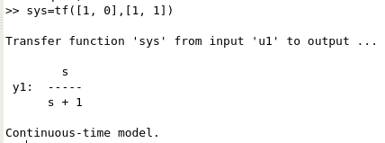
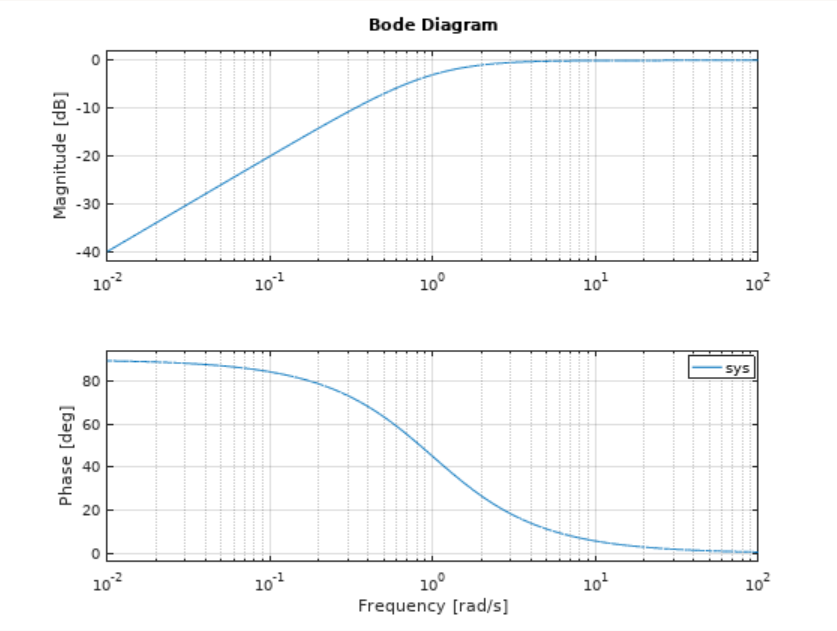
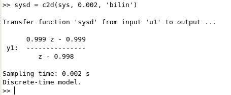
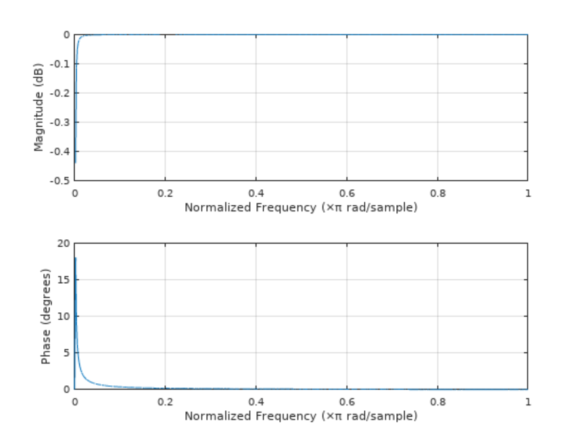
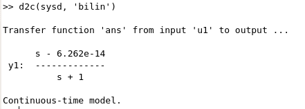

#### 一阶高通滤波器实例

||Octave | 图像 |
|----|----|----|
|传递函数|||
|离散传递函数|||

也可以手动推导， 将双线性变换$s=\frac{2}{T}\frac{1-z^{-1}}{1+z^{-1}}$带入$G(s)=\frac{s}{s+1}$得到
$H(z)=\frac{1-z^{-1}}{1.001-0.999z^{-1}}=\frac{0.999-0.999z^{-1}}{1-0.998z^{-1}},\quad T=0.002$

也可以反过来由离散传递函数得到连续系统的传递函数

这里稍微奇怪的是分子上的$6.262e-14$，手动将$z=\frac{2+sT}{2-sT}$带入计算是没有的。不确定引入的原因是由于精度限制，还是d2c的实现方法。

