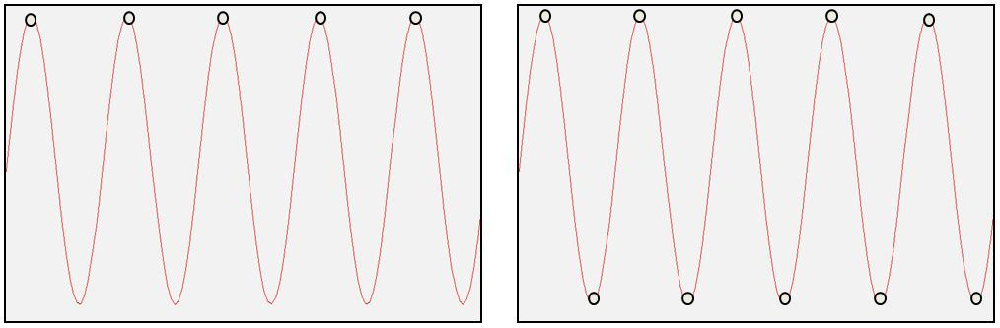

# 混叠

##### 混叠现象

当采样频率设置不合理时，即采样频率低于2倍的信号频率时，会导致原本的高频信号被采样成低频信号。如下图所示，红色信号是原始的高频信号，但是由于采样频率不满足采样定理的要求，导致实际采样点如图中蓝色实心点所示，将这些蓝色实际采样点连成曲线，可以明显地看出这是一个低频信号。在图示的时间长度内，原始红色信号有18个周期，但采样后的蓝色信号只有2个周期。也就是采样后的信号频率成分为原始信号频率成分的1/9，这就是所谓的**混叠：高频混叠成低频**了。

接着再来看这种情况下频谱图，

从图中可以看到正弦波不再是单一的频率（10/9），出现了两个

倘若还是对上述正弦信号进行采样，但采样频率等于信号频率，也就是采样的时间间隔等于信号周期，因而，信号的每个周期只能采集到一个数据，将这样采样数据点连成线条，得到的线条将是一条直线，因而，对应的频率成分为0Hz。

如果采样频率调整为正弦信号的频率的2倍，即采样的时间间隔为信号周期的一半，因此，信号每个周期内的采样点数为2，也就是每个周期采集两个数据点。将这些采样点连成线条，得到的信号形状为三角波，虽然信号的频率成分没有失真，但信号的幅值多数情况下都是失真的。因为这两个采样点很难位于正弦信号的波峰与波谷处，并且也只有这种特殊情况下，频率和幅值同时保持。

通常情况下，对连续信号进行等时间采样时，如果采样频率不满足采样定理(采样频率小于2倍的信号频率，即$f_s<2*f_a$)，采样后的信号频率就会发生混叠，即高于奈奎斯特频率（采样频率的一半）的频率成分将被重构成低于奈奎斯特频率的信号。这种频谱的重叠导致的失真称为混叠，也就是高频信号被混叠成了低频信号。如下面左图所示，由于信号中存在超出奈奎斯特频率的信号存在，采样后的信号，将会使超过奈奎斯特频率成分之上的频率关于奈奎斯特频率镜像到奈奎斯特频率以下的可观测区域，如下面右图所示。

##### 例子
用于演示混叠现象的最经典例子之一是所谓的“车轮效应”。在影片里当马车越走越快时，马车车轮似乎越走越慢，然后甚至朝反方向运转。

与车轮效应相同的是转动的吊扇，小时候都见过家中的吊扇，当转速越来越快时，出现的现象是先顺时针旋转，然后静止，然后逆时针旋转。

这是因为人眼在看物体时，人眼也有一定的采样速率。当人眼的采样速率跟不上越来越快的转速时，就会出现混叠现象。静止不动时的转速对应的频率就是人眼的采样速率。

倒转现象是因为高速旋转的叶片转速非常快，在短时间内从0度顺时针旋转到330度时（假设的情况），人眼观察到的似乎是从360度逆时针旋转到330度，因此，看起来像是在倒转。

倘若对一个正弦信号进行采样，如果采样频率等于信号频率，那么采样的时间间隔等于信号周期，因而，信号的每个周期只能采集到一个数据，如下面左图所示，将这样采样数据点连成线条，得到的线条将是一条直线，因而，对应的频率成分为0Hz。

如果采样频率为这个正弦信号的频率成分的2倍，因而，采样的时间间隔为信号周期的一半，因此，信号每个周期内的采样点数为2，也就是每个周期采集两个数据点，如上面右图所示。将这些采样点连成线条，得到的信号形状为三角波，虽然信号的频率成分没有失信，但是很难保证信号的幅值不失真。因为这两个采样点很难位于正弦信号的波峰与波谷处。也就是说，在很大程度上，采样后的信号的幅值是失真的。

##### 最小化混叠
既然信号可能存在混叠，怎样才能最小化混叠或者消除混叠呢？

初看起来，如果信号中没有高于奈奎斯特频率的频率成分，那么则不存在混叠。这要求采样频率极高，使得实际信号都位于奈奎斯特频率以下。但这不总是实用和可能，因为，您永远不知道真实信号的频率成分。另一个方面，虽然采样频率极高可以一定程度上避免混叠，但这样会导致出现大的数据文件，同时，最高采样频率受数据采集设备的限制。

另外，采样定理只保证了信号不被歪曲为低频信号，即使高的采样频率也不能保证不受高频信号的干扰，如果传感器输出的信号中含有比奈奎斯特频率还高的频率成分存在，ADC同样会以所选采样频率加以采样，使高于奈奎斯特频率的频率成分混入分析带宽之内。

故在采样前，应把高于奈奎斯特频率成分以上的频率滤掉，这就需要抗混叠滤波器，它是一个低通滤波器：低于奈奎斯特频率的频率通过，移除高于奈奎斯特频率的频率成分，这是理想的滤波器。

|理想滤波器|实际滤波器|
|||

实际情况是任何滤波器都不是理想的滤波器，抗混叠滤波器也不例外。滤波器存在滤波陡度，在滤波截止频率（奈奎斯特频率）以上的一些区域还存在混叠的可能性，这个区域对应带宽的80%以上部分，也就是带宽的80%-100%区域。如下图所示，高于奈奎斯特频率以上的频率成分会关于奈奎斯特频率镜像到带宽的80%-100%区域，形成混叠，而带宽80%以内的区域，是无混叠的。

当然了，如果信号中没有高于奈奎斯特频率的成分存在，则整个带宽都不存在混叠。当信号还有高于奈奎斯特频率有成分存在时，按采样定理设置采样频率时，带宽的80%以上频带则存在混叠，如下图红框所示区域即遭受了频率混叠的影响。由于带宽以上还有信号存在，因此，这些频率关于带宽镜像到了带宽以内。

通过这一部分的分析可知，即使使用抗混叠滤波器，在带宽的80%以上的频率区间还可能存在混叠，如要整个频带都无混叠，则采样频率至少高于信号频率的2.5倍以上。

链接：
* [什么是混叠?](https://zhuanlan.zhihu.com/p/23923059)

