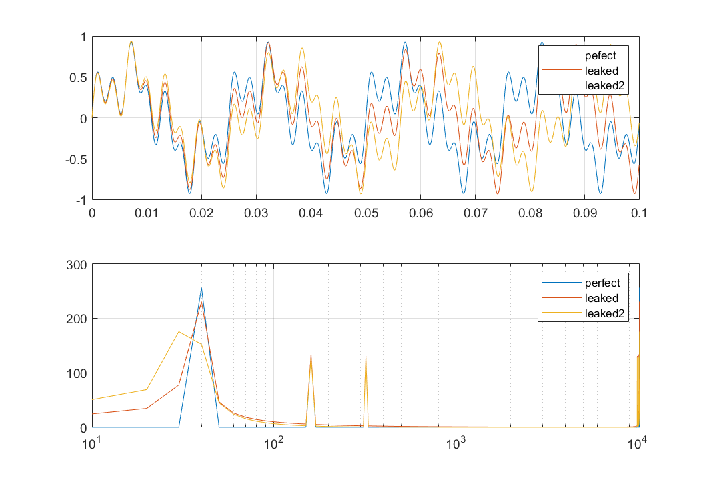

频谱泄露的示例不容易做
- fft要求样本点数为2^N，如果不是，会补零，自然引入别的频点；
- 为了清晰，希望测试例只有少数几个频点，不能采用锯齿波之类；
- 要求示例最前和最后两个样本点值相同，还会要求对比示例最前和最后两个样本点值不同

目的
- 泄露后会多那些频点
- 泄露对不同的频点影响是否相同

假定样本个数为1024，波形有三个频点分别跨256、64、32个样本点。不妨假定总采样时间就是0.1s，三个频率值也就是40、160、320，
所以示例函数为 

$$x(t)=\frac{1}{3}(sin(40\times 2\times\pi\times t)+sin(160\times 2\times \pi\times t)+sin(320\times 2\times \pi\times t))$$

对比样例不能在上面函数中只更改相位，否则最前和最后两个点的值还是相同。这里采样更改一个频率值，把40改成37.5(为什么？)，这样除泄露外其它的特性应该也比较相似。

- 最前和最后两个点相位差异越大，频率泄露越严重(修改第一项频率产生相位差)，跟幅值差异无关。图中采用的三个频率分别为40hz，37.5Hz，35Hz，对应的相位差分别为0，pi/2, pi
- 采样周期越多，频率泄露越轻(修改采样时间和第一项频率)
- 除了第一个主频点外，其它两个频点恰好是整周期的，没有发现泄露

总体来说泄露跟采样数是否匹配波形真实的整周期有关，如果匹配，不发生泄露，否则，不匹配的频点会发生泄露。

 [实验代码](spectrum_leakage.m)

### 为什么泄露总是发生在有截断的频点附近

假定信号只有一个频点
$$x(t)= c_n e^{jn\omega t},\quad \omega=\frac{2\pi}{T}$$

求它的傅里叶变换系数
$$\begin{align}
c_m^\prime &= \frac{1}{t_0+kT}\int_{0}^{t_0+kT}x(t)e^{jm\omega t}\rm{d}t \\\\
&= \frac{1}{t_0+kT}\int_0^{t_0+kT}c_n e^{jn\omega t}e^{-jm\omega t}\rm{d} t\\\\
&=\frac{1}{t_0+kT}\int_0^{t_0}c_n e^{j(n-m)\omega t}\rm{d}t + \frac{1}{t_0+kT}\int_0^{kT}c_n e^{j(n-m)\omega t}\rm{d}t\\\\
&=\begin{cases}
c_n &\quad m=n\\\\
\frac{1}{t_0+kT}\int_0^{t_0}c_n e^{j(n-m)\omega t}\rm{d}t\quad \equiv g(n-m) &\quad m\neq n\\\\
\end{cases}
\end{align}
$$

如果正好是整周期，则$t_0=0$，则不会多出其它的频点，否则 $g(n-m)\neq 0$, 会有其它频点的生成。

再来看泄露的功率情况
$$
\begin{align*}
|g(n-m)| &= \left| \frac{1}{(t_0+kT)(n-m)w}\int_0^{\frac{t_0}{(n-m)\omega}}c_n e^{jt}\rm{d}t \right| \\\\
&\leq \frac{1}{(t_0+kT)(n-m)w}\int_0^{\frac{t_0}{(n-m)\omega}}|c_n|\rm{d}t\\\\
&=\frac{|c_n|t_0}{(t_0+kT)(n-m)^2 w^2}\\\\
&\equiv G(n-m)
\end{align*}
$$
能够知道G(n-m)是信号的一个包络，

- g(n-m)在m，n固定的情况下， 显然k越大，也就是包含的周期越多，得到的新频点系数越小，影响也就小。

- 随着|n-m|越大，G(n-m)单调递减，也就是说频谱主要泄露在频点临近区域

任何信号都成表示成傅里叶级数的形式，泄露只会发生在非整周期的频点上，然后在相互叠加。
$$
x(t)= \sum_{n=-\infty}^{+\infty} c_n e^{jn\omega}
$$
