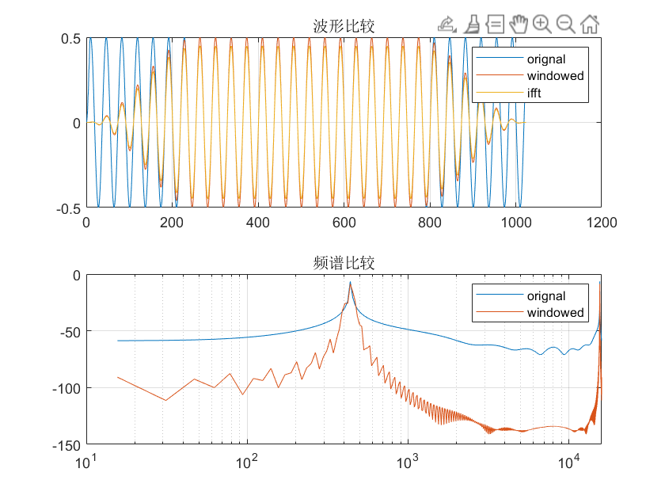

该Tone音由SOF的Tone算法产生，对应的配置为频率400Hz，幅值0.5，爬坡幅度0.1，采样率16KHz。[代码](tone_wave_440Hz.m), [Tone数据](tone_wave_440Hz.pcm)

- 波形开始的不平滑是由Fade In效果产生的，5次以后正常；
- Tone音的阶段不是整周期的，会产生较远的频率；
- 440Hz频率附近的频率猜测由开头的爬坡引起；
- 440Hz实际对应的幅值为0.5，对应的分贝值为 $20 log10(0.5)=-20*log10(2)=-6Db$；实际计算的大约为-7.17Db；
- 440Hz以外的频率对应幅值差别较大。

这是加hann窗后的数据和频谱图，能看到Tone音在边界被归零，还有频谱图变得陡峭，更加突出了原始的频点。[代码](tone_wave_440Hz_window.m) 

但仍然没有达到跟Audacity一样的效果，下图是由Audacity导入PCM文件后生成的频谱分析

