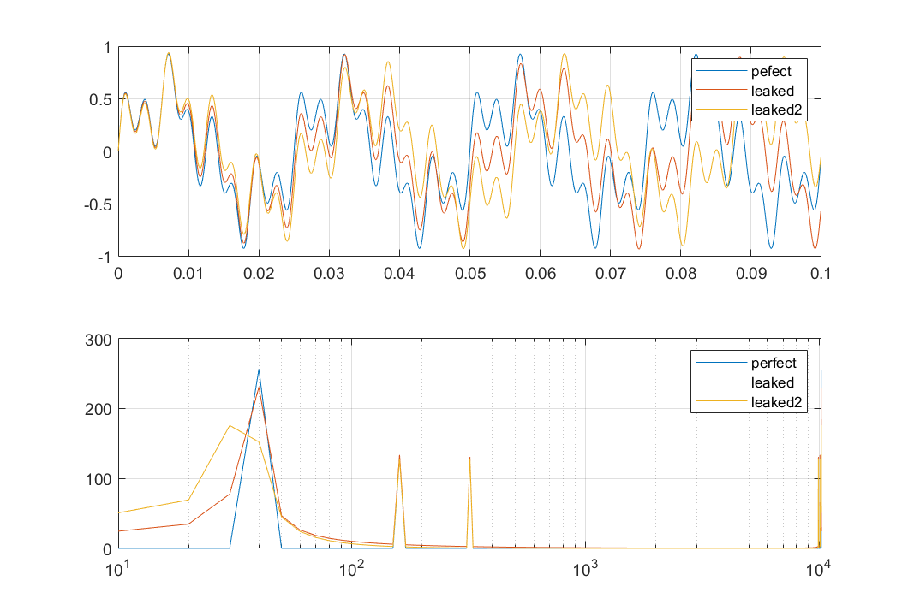

频谱泄露的示例不容易做
- fft要求样本点数为2^N，如果不是，会补零，自然引入别的频点；
- 为了清晰，希望测试例只有少数几个频点，不能采用锯齿波之类；
- 要求示例最前和最后两个样本点值相同，还会要求对比示例最前和最后两个样本点值不同

目的
- 泄露后会多那些频点
- 泄露对不同的频点影响是否相同

假定样本个数为1024，波形有三个频点分别跨256、64、32个样本点。不妨假定总采样时间就是0.1s，三个频率值也就是40、160、320，
所以示例函数为 

$$x(t)=\frac{1}{3}(sin(40\times 2\times\pi\times t)+sin(160\times 2\times \pi\times t)+sin(320\times 2\times \pi\times t))$$

对比样例不能在上面函数中只更改相位，否则最前和最后两个点的值还是相同。这里采样更改一个频率值，把40改成37.5(为什么？)，这样除泄露外其它的特性应该也比较相似。



- 周期截断的情况没有发现频谱泄露

  ```
  % X = abs(fft(x))
  X(find(X>0.0001))
  
  ans =
  
     256   128   128   128   128   256
  ```

  

- 最前和最后两个点相位差异越大，频率泄露越严重(修改第一项频率产生相位差)，跟幅值差异无关。图中采用的三个频率分别为40hz，37.5Hz，35Hz，对应的相位差分别为0，pi/2, pi

- 采样周期越多，频率泄露越轻(修改采样时间和第一项频率)

- 除了第一个主频点外，其它两个频点恰好是整周期的，没有发现泄露

总体来说泄露跟采样数是否匹配波形真实的整周期有关，如果匹配，不发生泄露，否则，不匹配的频点会发生泄露。

 [实验代码](spectrum_leakage.m)
