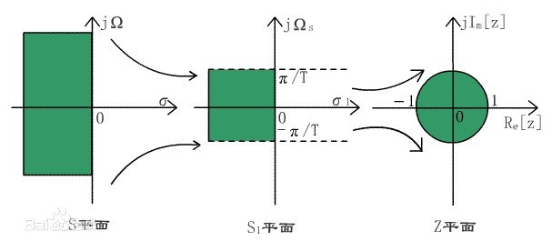

##### 双线性（Tustin）变换
方法是用梯形面积取代数值积分；特点和后向差分类似。但线性范围比后向差分要大。

已知z域和s域的关系为 $z=e^{sT}$，但是这种方式会造成频谱的混叠。重写该公式
$z=e^{sT}=\frac{e^{sT/2}}{e^{-sT/2}}$
在原点sT/2=0处对上式进行泰勒展开,并砍去高阶项，很容易得到
$z\approx\frac{1+sT/2}{1-sT/2}$
最终得到对应关系
$s=\frac{2}{T}\frac{1-z^{-1}}{1+z^{-1}} \quad\text{和}\quad z=\frac{1+sT/2}{1-sT/2}$
由于分子和分母都是s的线性关系，所以这个式子就叫双线性变换。

链接：
* [双线性变换法详解](https://zhuanlan.zhihu.com/p/265965580)
* [双线性变换法原理的理解](https://www.doc88.com/p-5793946621783.html?r=1)

