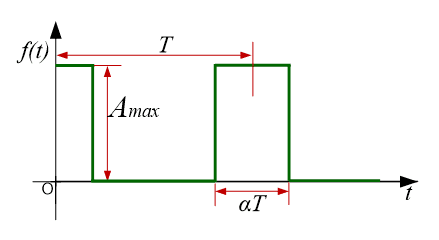

一些常见波形的傅里叶级数[1](#refer-anchor-1)
|名称|图像|傅里叶级数|
|---|---|---|
|方波|| |
|脉冲波|||
|梯形波|||
|三角波|||
|锯齿波|||
           

               

- [1][常见波形的傅里叶级数展开式](https://www.jianshu.com/p/be892506be75)  

- [2] [Fourier Series Examples](https://lpsa.swarthmore.edu/Fourier/Series/ExFS.html)
